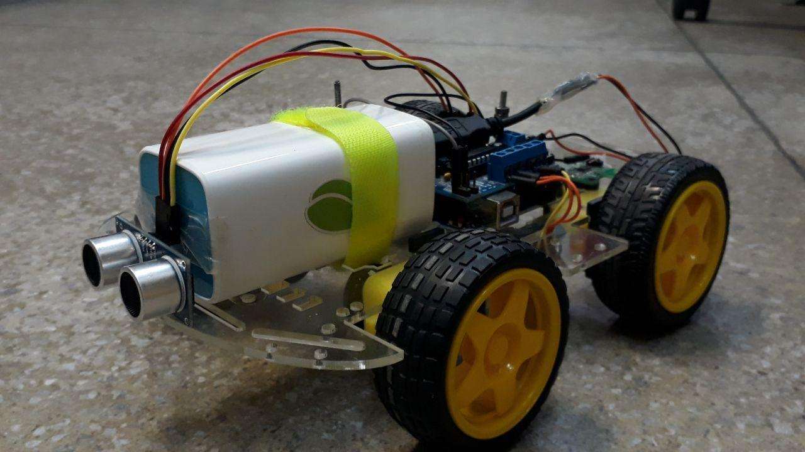

## About

<a href="http://ufrpe.br/" target="_blank">Federal Rural University of Pernambuco</a> 
<a href="http://www.ppgia.ufrpe.br/" target="_blank">Master's Degree Programme in Applied Informatics</a> 
<a href="https://jualabs.wordpress.com/" target="_blank">Computational Infrastructure Research Laboratory</a> 

This repository presents the modeling of a controller based on the Supervisory Control Theory. After modeling in <a href="http://heptagon.gforge.inria.fr/pub/heptagon-manual.pdf" target="_blank">BZR language</a>, the controller was synthesized using the <a href="http://heptagon.gforge.inria.fr/" target="_blank">Heptagon/BZR</a> and <a href="http://www.irisa.fr/vertecs/Logiciels/sigali.html" target="_blank">Sigali</a> tools. The controller was deployed in an Arduino UNO to control the movement of a 4WD Robot Car using a distance sensor (SR-04).

A tutorial for the development process is presented in our web <a href="https://jualabs.wordpress.com/2019/03/14/programacao-de-veiculos-autonomos-com-linguagem-bzr-parte-1/" target="_blank">site</a> (Portuguese).

## Robot

---

## Support

Reach out to me at one of the following places!

- Linkedin at <a href="http://linkedin.com/in/diegodefb/" target="_blank">`diegodefb`</a>
- Twitter at <a href="https://twitter.com/ddefb" target="_blank">`@ddefb`</a>

## License

- **[MIT license](http://opensource.org/licenses/mit-license.php)**
- Copyright 2019 © <a href="http://ddefb.me/" target="_blank">Diego Bezerra</a>.
